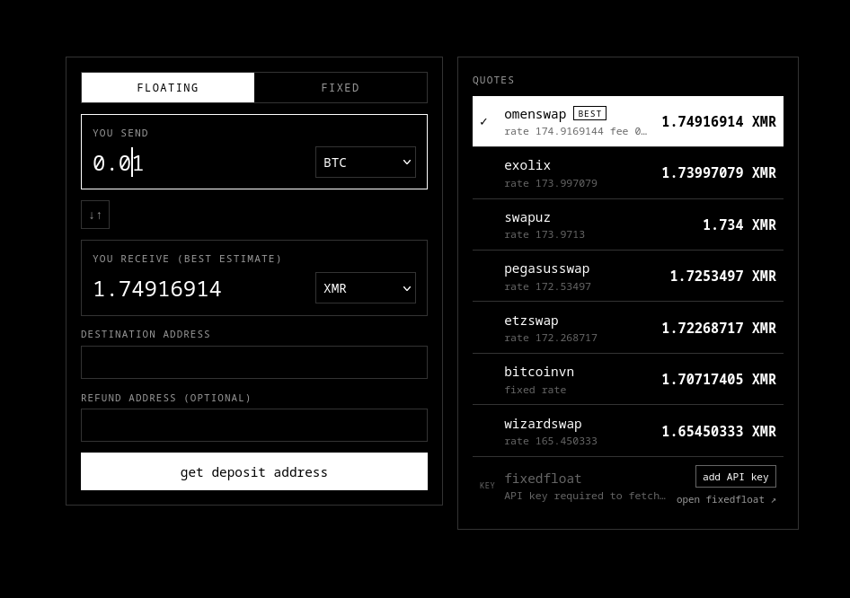

<h1 align="center">Swap Aggregator</h1>

<p align="center">Compare rates across popular crypto instant exchanges.
One unified interface for all your cross-chain swaps.</p>

<div align="center"></div>

<p align="center">Inspired by <a href="https://trocador.app">Trocador</a>, <a href="https://orangefren.com">OrangeFren</a>, and <a href="https://swapzone.io/">Swapzone</a>.</p>

## Supported Providers

| Provider | API key required | KYC | Coins supported |
|----------|------------------|-------|---------------|
| [FixedFloat](https://ff.io) | yes | sometimes | XMR, BTC, ETH, USDT, USDC, 50+ more |
| [Exolix](https://exolix.com)     | only for swap execution | never | XMR, BTC, ETH, USDT, USDC, 100+ more |
| [omenswap](https://omenswap.com) | no | never | XMR, BTC, ETH, USDT, USDC, SOL |
| [BitcoinVN](https://bitcoinvn.io) | yes | sometimes | XMR, BTC, ETH, USDT, USDC, 30+ more |
| [PegasusSwap](https://pegasusswap.com/) | yes | never | XMR, BTC, ETH, USDT, USDC, 30+ more |
| [Swapuz](https://swapuz.com/) | yes | never | XMR, BTC, ETH, USDT, USDC, 100+ more |
| [WizardSwap](https://wizardswap.io) | theoretically no but very low ratelimit without one | never | XMR, BTC, LTC, ETH, BCH, DOGE |

Open a PR to add a new site!

## Configuration

```bash
# Copy example config file
cp config.example.toml config.toml
# Edit and choose which providers to enable
# Add API keys and affiliate codes as desired
vim config.toml
```

## Local Deployment
If you just want a local swap aggregator for getting the best deal on your own swaps, run locally
```bash
# get the code
git clone https://github.com/omenswap/swap-aggregator.git
cd ./swap-aggregator
# make sure golang is installed on your device (https://go.dev)
go run ./cmd/swap-aggregator/main.go
# navigate to http://localhost:8000 in your browser
```

## Production Deployment
If you want to host for external users, follow this guide for deploying on a Debian-based server.
```bash
# Install dependencies
apt install nginx snapd git -y
snap install --classic certbot
snap install --classic go
export PATH="$PATH:/snap/bin"

# Download source
cd /opt
git clone https://github.com/omenswap/swap-aggregator.git
cd ./swap-aggregator

# Configure
cp config.example.toml config.toml
vim config.toml

# Setup nginx
cat <<EOF > /etc/nginx/sites-available/swap-aggregator
server {
    server_name yourswapaggregator.com;
    listen 80;

    add_header X-Frame-Options "SAMEORIGIN" always;
    add_header X-Content-Type-Options "nosniff" always;
    add_header Referrer-Policy "strict-origin-when-cross-origin" always;
    add_header Strict-Transport-Security "max-age=63072000; includeSubDomains; preload" always;
    add_header Content-Security-Policy "default-src 'self'; script-src 'self'; style-src 'self'; img-src 'self' data:; object-src 'none'; frame-ancestors 'self'; base-uri 'self'; form-action 'self'" always;
    add_header Permissions-Policy "geolocation=(), microphone=(), camera=()" always;
    add_header Cross-Origin-Opener-Policy "same-origin" always;
    add_header Cross-Origin-Resource-Policy "same-origin" always;

    location / {
        proxy_pass http://localhost:8000;
    }
}
EOF
ln -s /etc/nginx/sites-available/swap-aggregator /etc/nginx/sites-enabled/swap-aggregator
systemctl reload nginx

# Get SSL cert
certbot --nginx -yd yourswapaggregator.com

# Build
go build -o swap-aggregator cmd/swap-aggregator/main.go

# Run as a service
cat <<EOF > /etc/systemd/system/swap-aggregator.service
[Unit]
Description=Swap aggregator service
After=network.target

[Service]
Type=simple
WorkingDirectory=/opt/swap-aggregator
ExecStart=/opt/swap-aggregator/swap-aggregator
Restart=on-failure
RestartSec=5

[Install]
WantedBy=multi-user.target
EOF

systemctl daemon-reload
systemctl enable --now swap-aggregator
```
